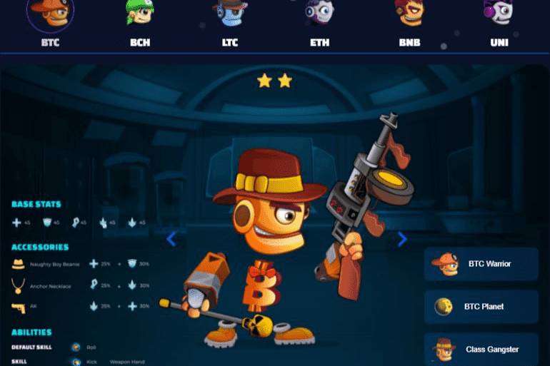

# DeFi Warrior

DeFi Warrior 是一款 DeFi x NFT Play2earn 区块链游戏，具有引人入胜的加密星系游戏故事。在 NFT 游戏大行其道的同时，DeFi Warrior 凭借游戏中 DeFi 和 NFT 的结合，以及加密世界的缩影故事脱颖而出。
在 DeFi Warrior 中，每个区块链都是一个星球，每个加密货币都是一个战士。这个星球也是战士们可以建造他们的硬币采矿工厂，并与老板或敌人战斗以获得奖励的地方。
BEP 20 支持的代币 FIWA 是主要代币。在 DeFi Warrior 的 NFT 市场进行交易需要 FIWA 代币。我们将在项目运行期间销毁 FIWA 代币
在游戏中，我们使用 eCWIG 进行几乎所有的游戏活动，并且可以使用 CWIG 代币进行交易。
由 BEP 721 支持的 NFT 勇士是游戏中的主角，可以在 NFT 市场上进行交易，并质押在矿池中以赚取代币。
这种游戏动态旨在实现两个基本目标：通过游戏将加密世界带给大众，并激发游戏玩家和加密投资者的好奇心。
