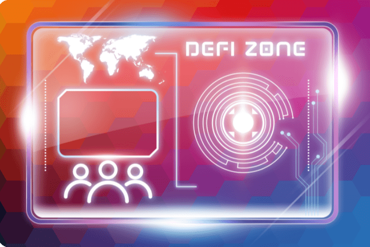

# DeFi Zone - ZONE ONE

DeFi ZONE Finance 是托管在 FTM 网络上的多区域收益农场。平台的每个区域通过高利息池和农场来复合对立区域代币中代币的效用。
这与质押奖励金库和强大的营销议程相结合，应该等同于成为一个更加稳定的 DeGen Yield Farm。
两个区域对 ZONE 和 ZTWO 的销售征收 5% 的转让税。
这笔转让税将 100% 被烧掉。
由于这两种代币都具有通缩机制，可以销毁原生 ZONE 和 ZTWO 代币，这将为代币价格提供额外的稳定性。 DeFi Zone 专为 FARMERS 打造，我们所有的平台升级都旨在延长平台的使用寿命。
