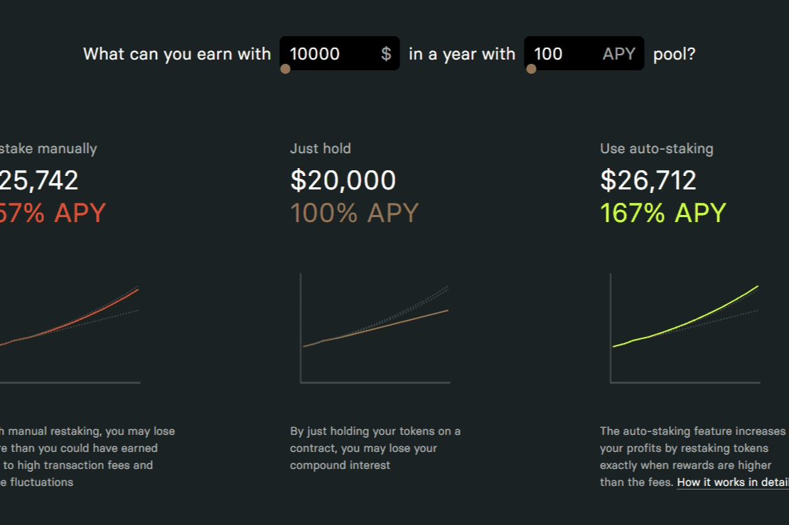

# DeFiHelper

DeFiHelper 是一种非托管投资助手，可帮助任何规模的投资者轻松管理和自动化其跨 500 种协议的 DeFi 投资。

建立和赚取
对于 DFH 来说，快速行动至关重要——添加新功能、连接新协议和区块链以及升级自动化脚本。为了快速发展，我们需要我们能得到的一切帮助。

我们是专业的开发人员，拥有超过 20 年的综合 Web 开发经验。在过去的五年中，我们主要从事区块链项目的启动。

我们有兴趣与开发商合作：

1) 前端（TypeScript、React.JS、GraphQL）
2) 后端（TypeScript、NodeJS、PostgreSQL）
3）区块链（Solidity、Ride、Rust）

如果您在此列表中发现自己的能力并希望获得丰厚的收入，请与我们联系，我们将讨论详细信息。

