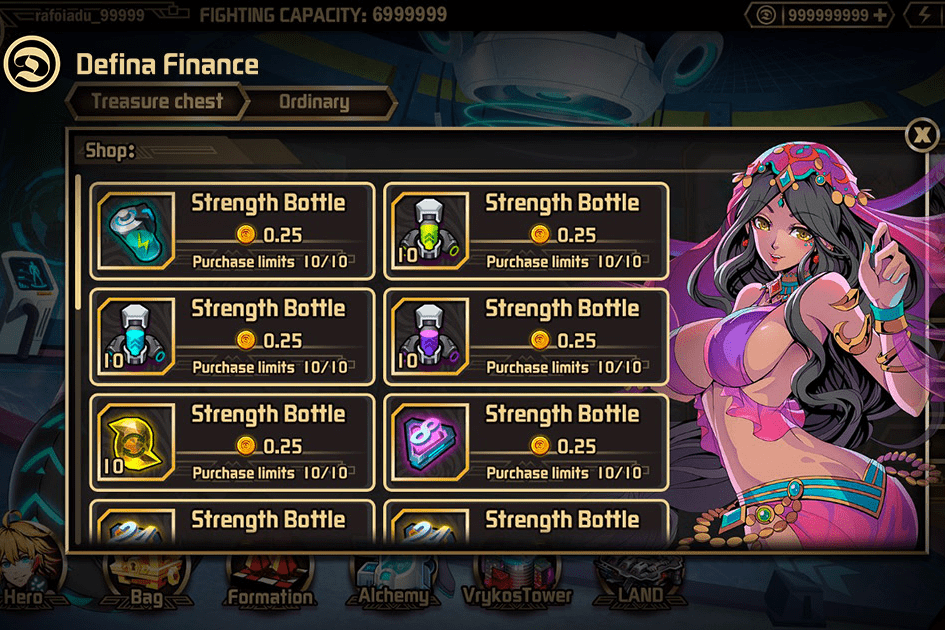

# Defina

Defina Finance 是一款在线区块链游戏，它利用并结合了去中心化金融 (Defi) 和 NFT，让玩家可以拥有自己的游戏资产并通过游戏和训练将其货币化。 Defina 的愿景是将区块链带给数百万玩家，让他们通过区块链技术探索一种新的游戏形式。
我们采用了一种“玩到赚”的系统，让玩家可以通过玩和交易他们的资产来获得奖励。 Defina 还拥有自己的代币 $FINA 代币，这是一种基于 BSC 的实用程序和治理代币，用于 Defina 生态系统等等。我们的游戏和我们的代币将成为大多数传统玩家体验去中心化金融并了解更多关于去中心化自治组织的门户，因为我们将在稍后实施质押奖励和治理系统。
欢迎来到新的游戏世界。

