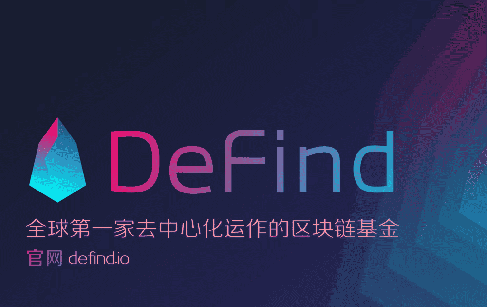

# DeFind

DeFi 是全球第一家共同去化的 EOS，DEFI 已经上线新的代币交易所，通过 EOS FI 获得 DEFI，DEFI 基金进行升华传播 20% 的收益，持有 DEFI 可以不断进行分到DeFind基金所投项目的代币。DeFind是全球首个去中心化EOS共同基金。代币 DEFI 已在 Newdex 交易所上市。 DEFI 可以通过 Resonance EOS 获得。使用 DEFI 进行升华，每月可享受 20% 的收益。抵押 DEFI 的持有者可以持续获得 DeFind 投资项目的代币。

