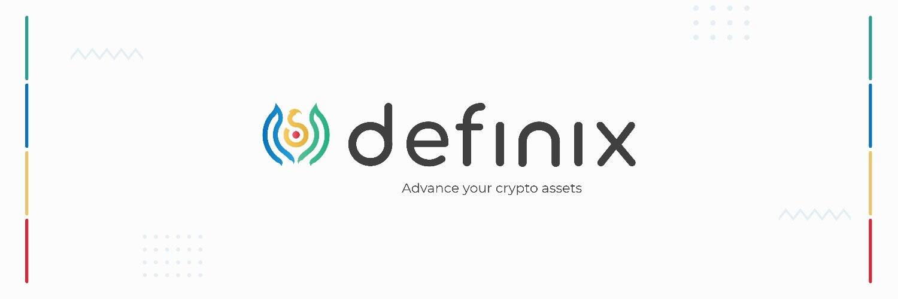

# Definix

Definix 是 DeFi 上透明的加密投资平台，帮助加密投资者自信地投资，并让专业交易者通过创建和管理自己的资金，从他们的投资技能中获得更多收益。

加密投资者
谁想开始投资可在流动性挖矿中交易的加密资产，加密管理基金。

专业交易员
希望拥有自己的加密基金成为我们平台的经理，并从绩效和管理费中获得激励。

参与者必须通过 Finix 挑战赛，这是一种纸质链上交易。

流动性提供和农业
对于加密投资者来说，交易加密货币是困难且风险很大的。流动性提供和农业对新来者更加友好。 Definix 拥有各种具有丰厚回报的矿池和农场，作为开始增长加密资产的低风险选择。假设流动性将成为平台上去中心化交易所的燃料。

自信地投资于专业管理的基金
如果您不太了解如何从加密交易中获利，请不要担心。您可以投资由专业交易员管理的加密货币基金。在专家的帮助下，您的投资组合可能会变得更容易。

用户生成的加密货币基金
对于高技能的交易者，他们可以来挑战我们的测试。如果他们通过了，他们可以在平台上创建自己的基金，并从基金管理费中赚取更多。

