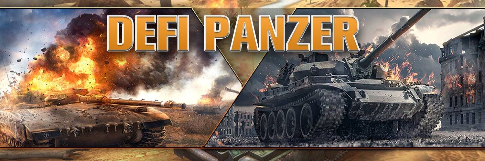

# DefiPanzer

Defi Panzer 是基于区块链的终极战略射击游戏大师，基于 Binance Smart 链构建的装甲战争艺术，专注于游戏化并推广游戏赚钱概念。

Defi Panzer 是基于区块链的战略坦克战游戏，建立在跨链网络上。内部跨链门户允许玩家轻松地将 DEP 和 Defi Panzer NFT 转移到不同的区块链上。每次移植都将收取费用，并将以 DEP 代币的形式收取。为了给目标链上的 Gas 费提供资金，玩家可以选择将 DEP 转换为他们的目标本地链货币来支付目标链的 Gas 费用。这项服务可以让玩家快速方便地加入新的连锁店。
该游戏最初将部署在 Solana、BSC、ETH、Polygon 和 Terra。

