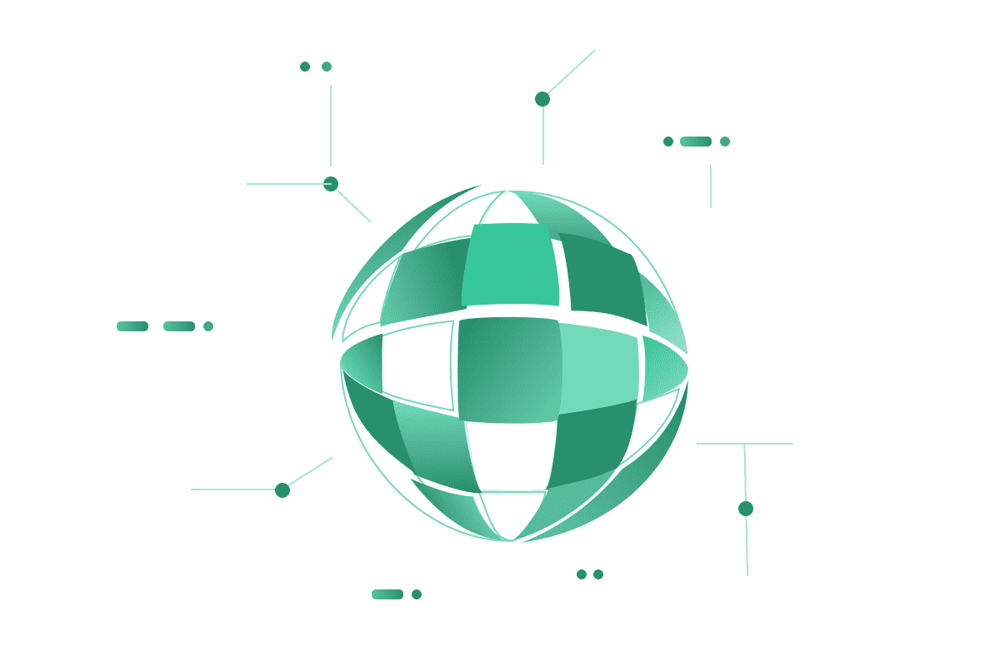

# DeFis Network

一个集成了一系列 DeFi 协议的开放金融网络。由于文化差异和主权管辖的地域限制，传统的金融基础设施相互孤立和支离破碎。基于区块链技术的开放金融网络将为传统金融基础设施带来革命性变革。该网络可以打破国际金融壁垒，收集全球流动性，创造网络效应，并在全球范围内创造货币和金融可编程性。 DFS代币用于交易、社区治理、流动性激励、协议手续费分红、Staking、发行和生成资产等。通过整合一系列DeFi协议，DeFis Network未来将在区块链金融领域形成强大的网络效应。平台币 DFS 将继续捕捉这些 DeFi 协议产生的价值。 DFS 持有者将继续从协议费用中获得红利。通过智能合约自动执行分红，让每个持有者公平分享 DeFis Network 发展的红利。

