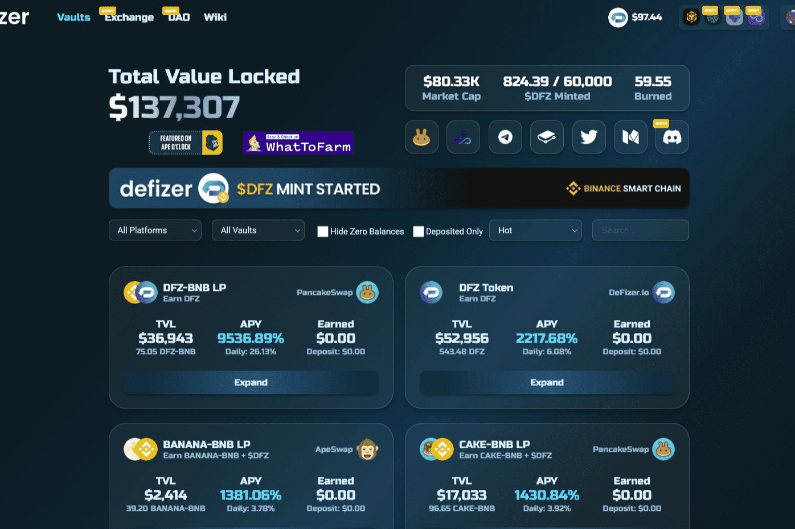

# DeFizer

Defizer.io 是什么？收益聚合器和优化器
Defizer.io 是内置于币安智能链的收益聚合器和优化器。在 defizer.io，用户可以在 DeFi 生态系统中找到最佳机会，提供世界一流的保险库产品、全面优化的智能合约、最佳收益策略和高 APY。
defizer.io 是我们新生态系统（Defizer 产品套件）的第一个产品。
初始价格将通过在公平启动后向 DFZ-BNB Pair 提供流动性来确定。 $DFZ 代币的最大供应量为 60,000。之后的挖矿计划就会变得通货紧缩。 $DFZ 代币持有者有权参与我们生态系统的所有空投。该代币将用于在我们的 DAO 中进行投票。
现在 DeFizer.io 仅适用于 BSC，新的链即将推出。
$DFZ 挖矿将于 12 月 4 日开始！真正的 FAIRLAUNCH 我们没有预知

