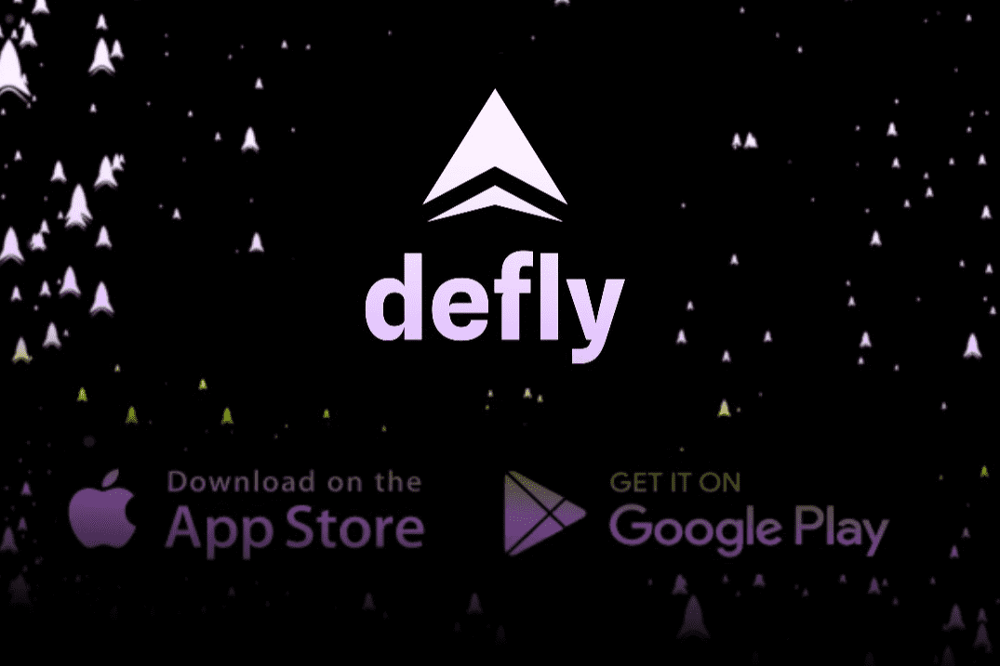

# Defly

**什么是飞飞？**一个移动应用程序中的图表、交换、统计数据，具有完整的 Algorand 可组合性。我们将传统加密交易和实时投资组合监控的最佳功能与 DEFI 的独立性和安全性相结合。 1.) 完全拥有您的资金 Defly 是一个自托管钱包，这意味着您是唯一可以访问您的私钥的人。与大多数加密货币交易所不同，Defly 的一切都旨在保持这种状态。 2.) 像专业人士一样进行交易 Defly 将最完整的市场视图打包到同类应用程序中。这意味着最好的态势市场意识始终支持您的决策。 3.) 与生态系统一起成长 Defly 有一个完整的路线图。随着 Algorand 的发展，应用程序的功能也将随之增长。第一站是多 DEX 交易，从 Tinyman 和 Algofi 开始。
我们的合作伙伴包括 Algorand Foundation、Xpand Capital、Algofi、Tinyman、Pact、Algodex、NFD

