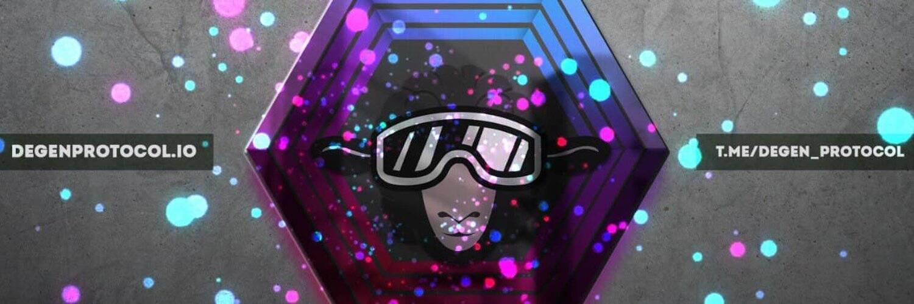

# Degen Protocol

DegenProtocol 是一个社区项目。加入我们！我们是您所有 DEFI 和被动收入的一站式商店。

有几种不同的方法可以在 2021 年增加你的加密货币持有量。你可以[购买](https://coinmarketcap.com/rankings/exchanges/)、[交易](https://coinmarketcap.com/exchanges/crypto-trade/)、[质押](https://coinmarketcap.com/alexandria/article/crypto-staking-guide-2021)，如果你是一个不择手段的低等人，你甚至可以通过[黑客](https://coinmarketcap.com/alexandria/article/british-exchange-halts-withdrawals-as-hackers-steal-funds-from-hot-wallets)和[诈骗](https://coinmarketcap.com/alexandria/glossary/scam)窃取它。但是，如果您没有资金和想法，还有更安全且完全合法的方法，因为还有另一种方法可以积累这些[satoshis](https://coinmarketcap.com/alexandria/glossary/satoshi-sats)：您可以赚取它。

“免费加密”真的存在吗？理论上是的。就像“免费啤酒”一样，所谓的 TANSTAAFL 经济原则通常适用：“天下没有免费的午餐”。它本质上意味着免费的东西需要工作。 

那么好消息。您可以卷起众所周知的袖子，从我们的“[学习并获得](https://coinmarketcap.com/earn/)”教育计划开始，我们会教您有关领先项目的知识，然后他们会以少量的加密货币作为回报来奖励您。这是我们加深对令人兴奋的新加密货币和[DeFi](https://coinmarketcap.com/defi/)项目了解的方式。这种类型的奖励计划可以被认为是一种加密水龙头。 

