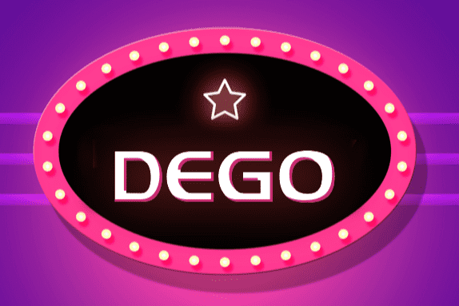

# DEGO Finance

DEGO采用模块化组合设计理念。模块化是指产品的各种要素组合成具有特定功能的子系统。我们将这个子系统作为一个通用模块与其他模块相结合，以创建一个具有多种功能和性能的新系统。
简而言之，每个产品都可以视为一个模块。不同模块组合后，新产品问世，从而达到1+1>2的效果。乐高积木是这些模块的最佳示例和灵感。每一块砖都平淡无奇，但拼凑起来却产生了无限可能。
DEGO 相当于 DeFi 世界中的 LEGO。每个 DeFi 协议都是一块砖，它可以是稳定币（DAI）、闪贷（Aave、Compound）、DEX 交易所（Uniswap 和 Balancer）、衍生品（Synthetix）、保险（Nexus Mutual）。围绕这些底层协议，我们将构建新的dapp，提升DeFi的价值，打造多元化的投资组合，为用户带来丰厚的财务回报，成为未来金融服务的入口。

