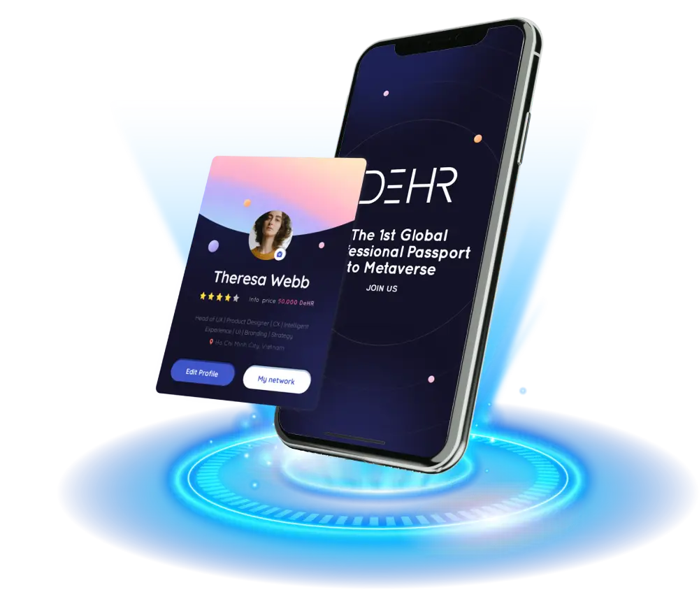

# DeHR

什么是 DeHR 网络？
去中心化的社会职业元宇宙
DeHR 是去中心化的社会职业元宇宙，人们可以在其中完全控制数据以赚取收入、全球工作和人际关系。
“CONNECT TO EARN”是我们为您构建的预先设计的任务机制，旨在使您的个人资料变得更加合法，扩大您的网络并获得更多工作机会。在网络中，用户和专业用户都建立了一个社交职业网络，人们通过专业信息相互了解和直接联系，但后来广泛连接为大社区或深入到具有各种爱好、兴趣、需求的私人团体......这是你的权利，个人的，完全的。
DeHR 允许用户设置其数据的价格，然后在专业用户访问其护照时接收 DeHR 代币。用户将有机会通过日常行动每天赚取 DeHR，并将被允许创建他们的 DeHR 费用以供专业用户联系。从学生到员工，再到专业雇主； DeHR 在许多职业生涯中提供效用。

