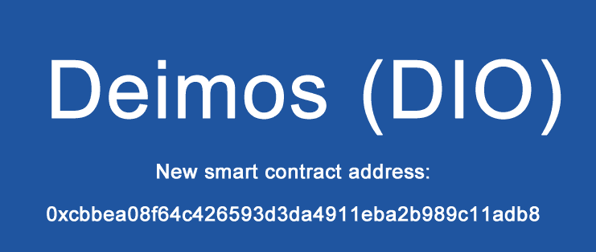

# Deimos Token

Deimos Token 是一个开源平台，利用区块链技术的分布式和去中心化特性，促进币安智能链生态系统中不同资产类别的更多采用。

Deimos 是一种基于现有币安智能链的加密货币，遵循 BEP-20 代币标准。该项目的主要目的是为用户提供一个安全的匿名平台以进行安全交易。

我们的目标是让每个人都拥有一个独立运行的金融系统，让世界能够创建基于区块链的银行软件，让用户成为他们的独立银行。我们的使命是为每个人提供简单而强大的银行业务，以支持从世界各个角落轻松访问的财务。

