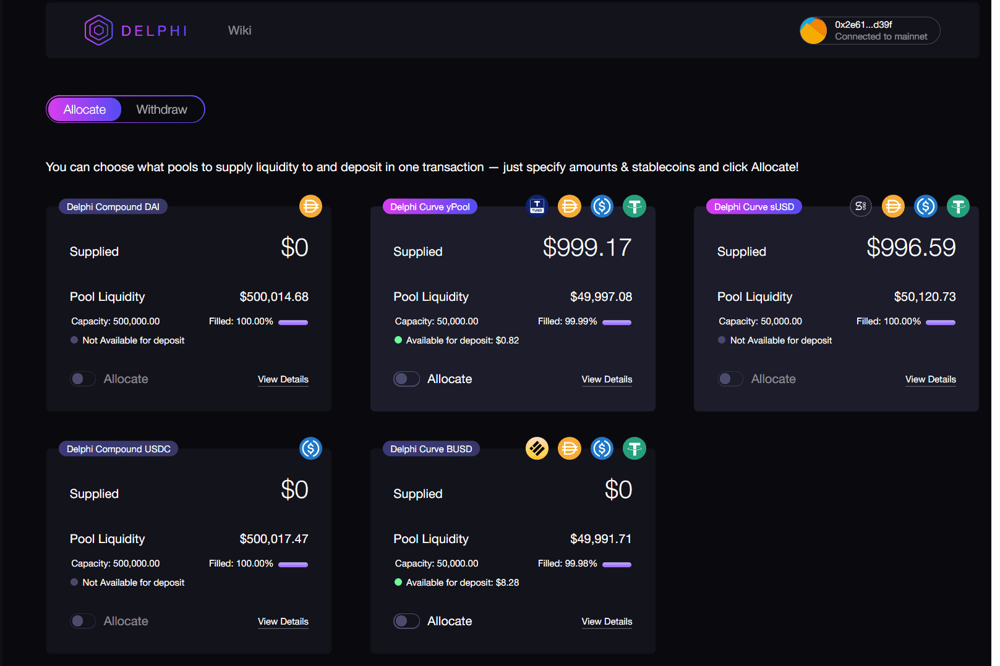

# Delphi

Delphi 是一个 DeFi 收益农业聚合器和美元成本平均工具，它提供合成储蓄和高收益“账户”，针对没有深厚技术知识和对以太坊和加密货币有一定了解的对 DeFi 好奇的用户。 Delphi 由 Akropolis 团队构建，是基于 AkropolisOS 构建的第二个产品。

Delphi 11 版本增加了对 Windows 11、macOS 12 Monterey、iOS 15 和 Android 12 的官方支持，并改进了 11 Alexandria 的里程碑功能，提供改进的 IDE 和用户体验、改进的代码洞察力、更强大的编译器和调试器，以及更丰富的 RTL、UI 和数据库库。

