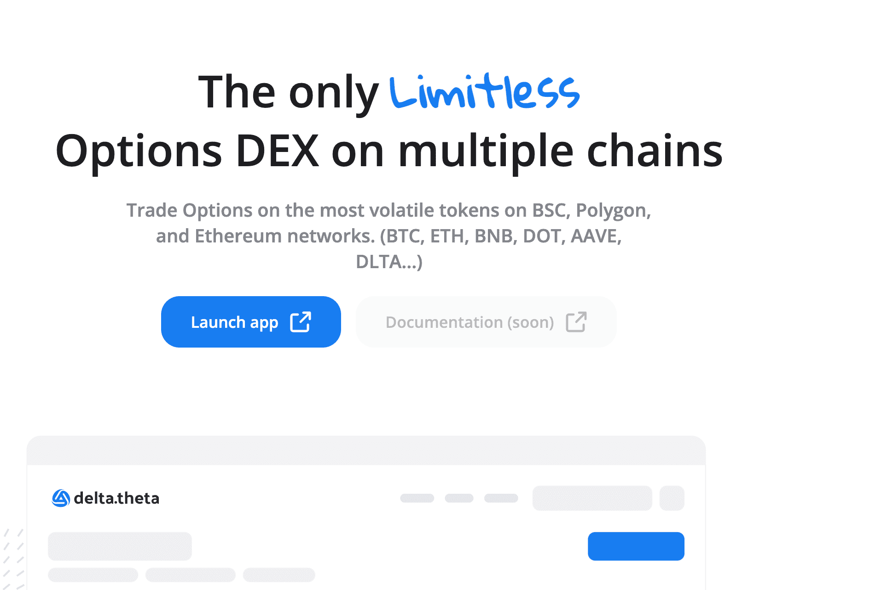

# delta.theta

delta.theta 是一个点对点期权交易平台，目前在币安智能链、Polygon 和以太坊上运行。简而言之，它是一种使 CEX 的期权流动性在链上可用的协议。 delta.theta 使实时订单簿做市商的去中心化网络能够对冲 DEX 期权与 CEX 订单簿。另一方面，DeFi 农民可以获得价格崩盘保险的最低保费。一、解决的问题 A、对 DeFi 农民的保护随着 DeFi TVL 的增长，对价格保险的需求也越来越大。此类解决方案主要以选项的形式提供。然而，期权的链上解决方案收取大量溢价，仅限于以太坊，并且没有足够的流动性。 Delta.theta 使用所有主要 CEX（Binance、Deribit 和 OKEx）的高流动性期权市场，并将流动性汇集到链上。精简版为以太坊以外的农民提供价格损失保护。 B. 专家交易者的 DeFi DeFi 主要围绕现货交易。 Aave 和 Compound 等协议也提供简单的保证金选项。然而，大多数 CEX 的平均交易杠杆超过 20 倍。期权可以提供 (a) 极端杠杆、(b) 对冲和 (c) 战略交易。目前，任何 DeFi 交易者都必须选择 CEX 才能正确参与期权。 Delta.theta 通过 BSC、Polygon 和 Ethereum 上的快速履行终端解决了这个问题。我们在主网工作。由于 21 年第三季度，我们获得了第一笔收入。

