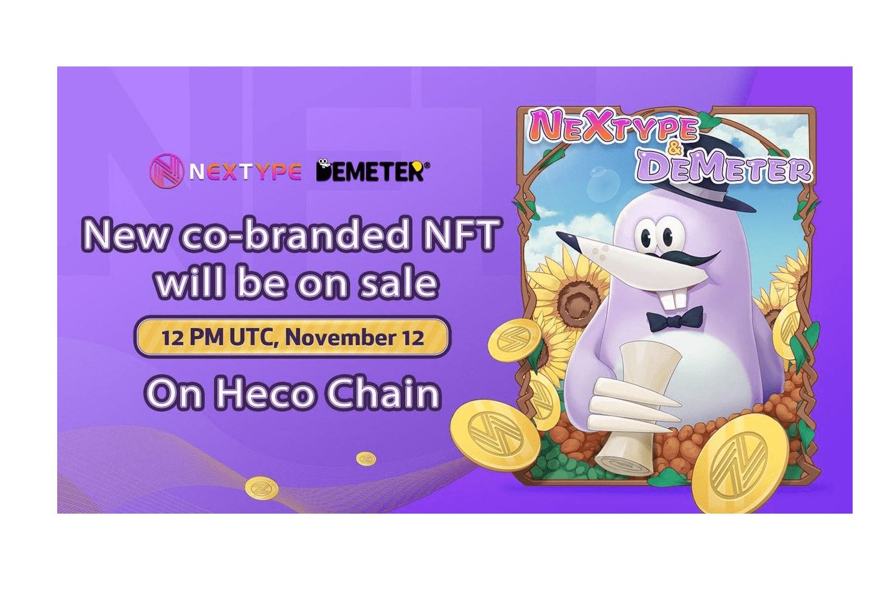

# Demeter

Demeter 是一个多链部署的去中心化货币市场协议。去中心化稳定币和借贷是我们目前的两个主要业务领域。
Demeter 72小时TVL上线，突破3.5亿美元，位居HECO借贷市场TOP1。 11 月 5 日，Demeter 部署 BSC 启动多链生态战略。 TVL 在 36 小时内超过 7000 万美元。
目前Demeter上线45天，稳定币单币收益率超过30%，DAO单币池收益率超过3000%。用户获得了良好而稳定的回报。我们的稳定币DUSD累计铸币量超过4亿美元，得到MDEX、Butterswap、Booster、Nextype、Coinwind、Rabbit、Aveswap、PIDAO、Babylons等众多BSC和HECO生态协议的支持。

