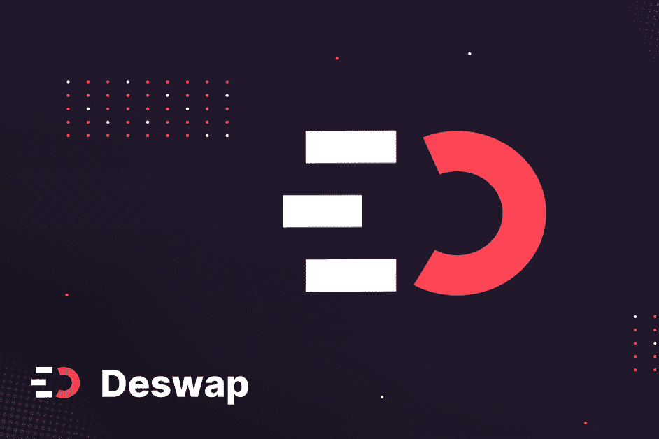

# Deswap

Deswap（DAW）是一种去中心化借贷协议，为世界上第一个基于多边形网络的去中心化稳定币（YAI）提供支持，该协议由一篮子稳定币和加密资产支持，没有集中控制。我们的目标是改变贷方和借款人，这样人们就可以交换资产，而不会以更高的汽油费的形式无缝损失资金。在 Polygon 链上，Deswap 协议旨在实现全面的算法货币市场协议。首先，Deswap 协议 (DAW) 将允许用户使用已提交给协议的基础抵押品中的 yToken 来铸造 YAI (YAI)，这是一种与 1 美元价格挂钩的合成稳定币。用户最多可以借用 yToken 中剩余抵押品价值的 50% 来铸造 YAI。 Deswap 协议上的稳定币可以综合创建，并通过治理作为提案添加。该协议的默认稳定币将是 YAI，它可以使用之前在 Deswap 中承诺的抵押品创建。使用提供给市场的抵押品的能力不仅可以借入其他资产，还可以铸造具有超额抵押头寸的合成稳定币，以保护基金会极低的汽油费和最快的区块确认是 Deswap 与其他货币市场协议的不同之处。

