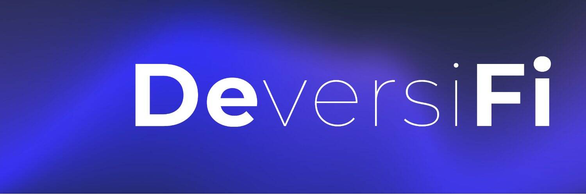

# DeversiFi

DeversiFi 唯一的高速去中心化交易所，交易者可以直接从其私人钱包的安全性中执行任何规模的订单。到 2020 年 3 月成为第一个由 StarkWare 提供支持的交易所。使用 DeversiFI，没有注册，没有存款或取款延迟，也没有牺牲对您的代币的保管。用户在对高流动性的链下订单簿执行交易的同时保留对其资金的完全控制权。凭借加密空间中流动性最强的订单簿之一，用户现在可以在不牺牲控制权的情况下利用高流动性、低点差的交易体验。此外，DeversiFi 部分由 necDAO 控制 - 一个拥有超过 17,000 ETH 的去中心化自治组织，使其成为最大的 DEX DAO 日期之一。

