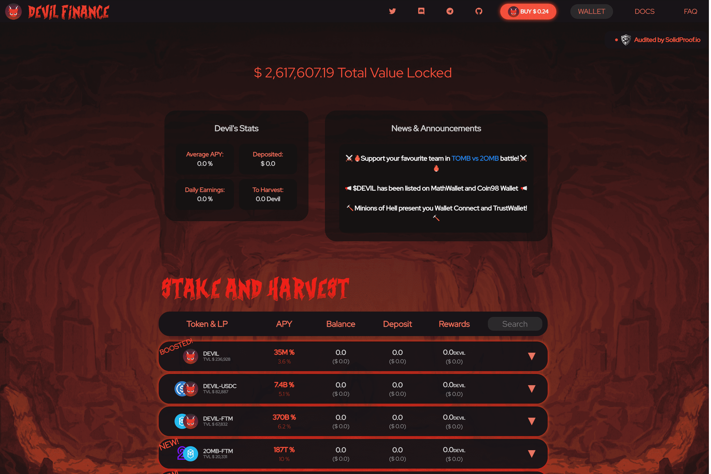

# Devil Finance

什么是恶魔金融？
本质上，Devil Finance 是一个去中心化收益优化器平台，允许其用户从他们的加密资产中赚取复利。 Devil Finance 在 Fantom 区块链上运行，并提供领先的市场收益策略和运营之一。
我们的使命是让我们的用户（初学者和专业人士）有机会以安全、高效和用户友好的方式为未来保存、增长和积累资产。
我们将提供对非法定通胀资产集合的访问权限。我们为使用我们的平台提供奖励，即以“质押”代币和我们的原生代币 (DEVIL) 的形式。
我们将从许多用户那里收集代币，并代表他们进行大规模的质押。通过更频繁的复利、更有效的天然气利用和其他创造性的自动化，我们将节省用户费用，最重要的是最大化他们的回报。

