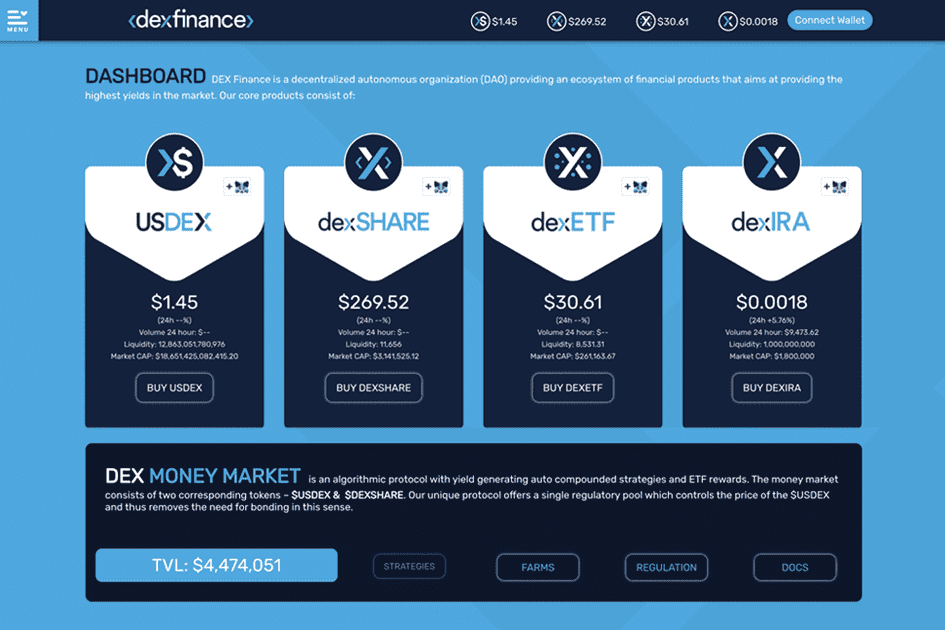

# Dex Finance

德克斯金融
Dex Finance 是一个去中心化的组织，提供可持续投资工具的生态系统。我们的协议旨在通过简化经验丰富的投资者采用的高级交易策略来增强用户的能力。
Dex 货币市场
Dex 货币市场是一种算法储备协议，具有多步自动复合策略和 ETF 奖励。我们的协议提供单一的监管机制和协议拥有的流动性。
受我们之前的项目（Tomb Finance、Olympus DAO、Balancer、Beefy Finance）的启发，我们开发了一种真正独特的多代币协议，通过简化经验丰富的投资者采用的高级交易策略为用户提供支持，并通过低风险算法促进增长交易模式。
指数ETF
使用我们的非托管加密管理协议构建您的投资组合。无论您的加密知识或技能水平如何，都可以轻松投资多种资产。我们的专家手工制作了市场领先的加密货币，只需一次交易即可购买。

dexIRA
全自动 BNB 再分配、多币种股息奖励、先进的回购协议和促进长期持有和财富产生的代币经济学。
右击垫
Dex Launch Pad 旨在通过提高流动性和分发代币来增强加密项目的能力。我们为投资者提供安全可靠的优质项目投资方式。
dexDAO
Dex Finance 是一个去中心化的自治组织（DAO），提供由社区管理的金融产品生态系统。我们的目标是建立一个政策控制的货币系统，在这个系统中，我们代币的行为受到 DAO 的高度控制。

