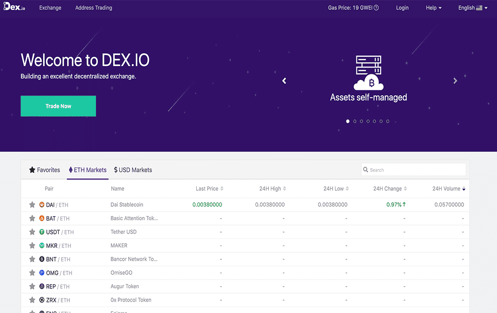

# DEX.io

DEX.io 旨在打造一个卓越的去中心化加密货币交易所。当前版本的 DEX.io 是以太坊上的混合去中心化交易所。提供链下撮合和链上结算，支持所有标准ERC20代币，实现有效的去中心化订单撮合，资产流程需要私钥数字签名。

去中心化交易所（更好地称为 DEX）是一个点对点市场，交易直接发生在加密交易者之间。 DEX 实现了加密的核心可能性之一：促进不受银行、经纪人、支付处理商或任何其他中介机构主持的金融交易。最受欢迎的 DEX——如 Uniswap 和 Sushiswap——利用以太坊区块链，并且是不断增长的去中心化金融 (DeFi) 工具套件的一部分，这些工具可以直接从兼容的加密钱包中获得大量金融服务。 DEX 正在蓬勃发展——在 2021 年第一季度，有 2170 亿美元的交易流经去中心化交易所。截至 2021 年 4 月，DeFi 交易者超过 200 万，是 2020 年 5 月的十倍。

