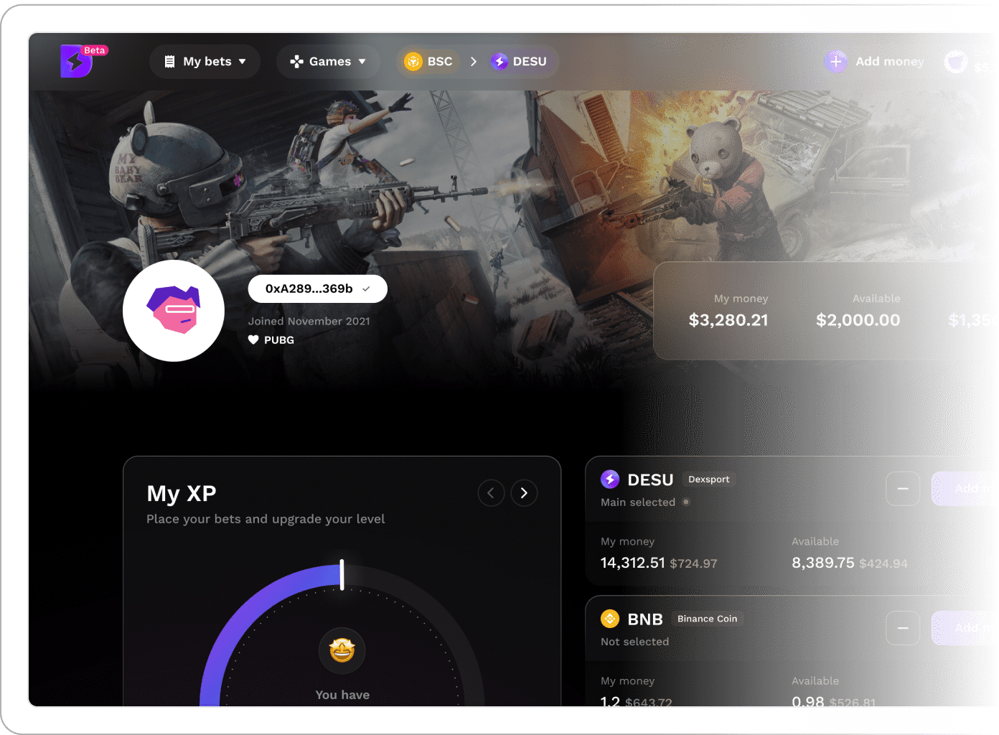

# Dexsport

Dexsport 是一个创新项目，它改变了用户对投注的看法。该平台是一个 DeFi 预测平台，包括：体育博彩、盈利投注、预测市场、P2P 加密货币汇率预测和 NFT 收集。
Dexsport 生态系统迎合了对博彩感兴趣的用户、区块链爱好者和有兴趣将资金投入公共流动资金池的投资者。

现有的投注工具对于普通用户来说过于复杂，需要大量具体和最新的知识，例如与矿池的交互、存款流动性和减轻非永久性损失

