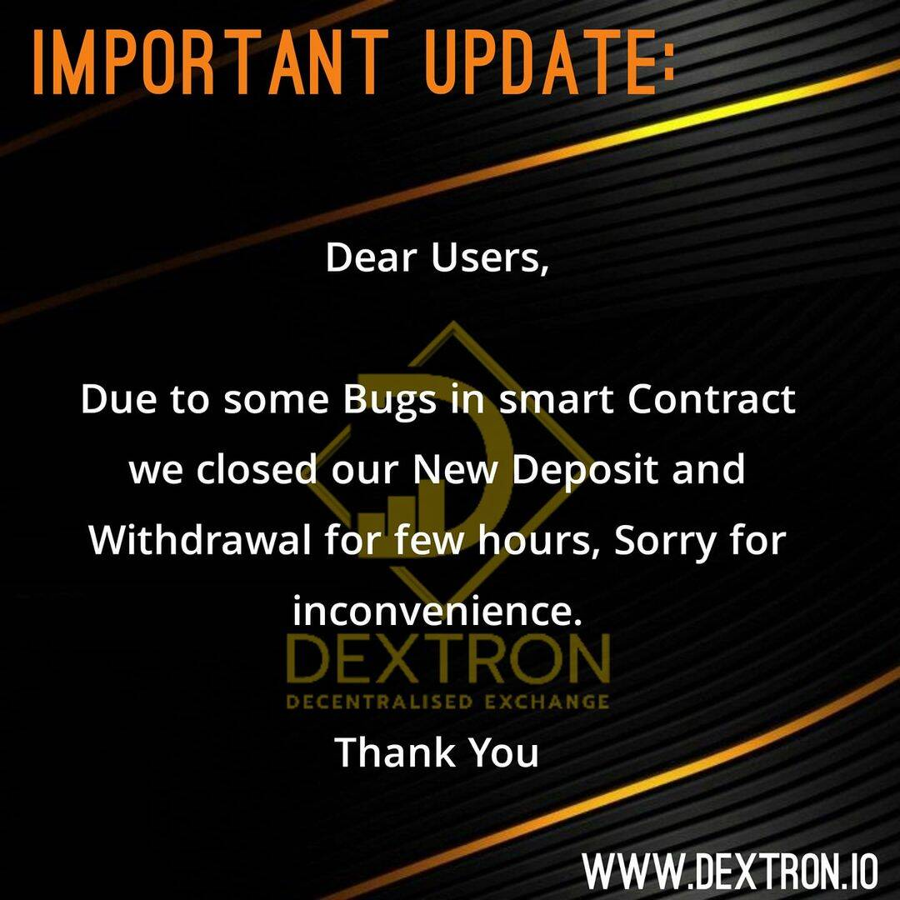

# DEXTRON

正如命名约定所说，DexTron 是一种直接交换机制。它是主要实体，致力于通过 Tron 区块链上的智能合约使用去中心化金融应用程序的解决方案。 DexTron 具有巨大的增长潜力和专门的推荐结构，通过他们的去中心化金融代币 CreDex (TRC20) 和游戏代币 PoloDex (TRC20) 推广和执行。
CreDex 是作为初始工具推出的，用于产生增长资本，为投资者制定分散的金融和银行战略，使用 Tron 区块链上的智能合约提供数字资产的股权、交易和借贷；从而消除当前多个数据库和ERP系统的依赖关系。 CreDex 标志着使用智能合约改进可扩展性和透明执行金融服务的曙光或出现，这些智能合约与即将到来的未来技术融合，这高度取决于 5G、物联网与区块链的结合。 DexTron 在加速和简化银行交易和其他金融程序方面取得了突破，例如替换 Escrow、改进数字身份管理以及使用 CreDex 令牌的更多金融服务。
PoloDex 是 DexTron 在新兴技术的层次结构和持续遗产下推出的 TRC20 游戏代币。 PoloDex 是纯游戏代币，它不会也不会提供、支持或推广任何投注和赌博活动。 PoloDex 最初是作为 DexTron 与 CreDex 的促销活动提供的；它为社区成员提供了随时随地玩各种游戏，参加各种比赛并获胜

