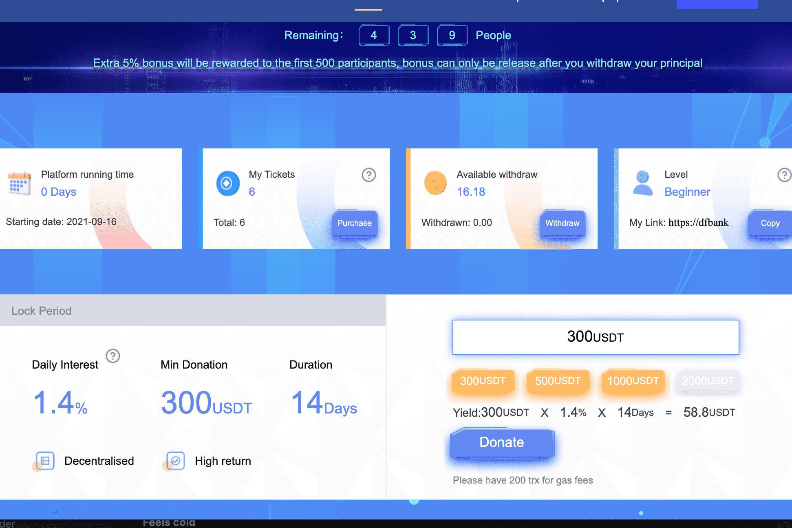

# DFB

1️⃣DFB运行在TRON区块链上，100%开源+专业审计。所有数据100%公开、透明、可追溯。这是一个互助系统，全球参与者聚集在一起，在区块链智能合约应用程序上互相帮助。这不是一个投资计划，而是一个全球性的社会基金，成员们在经济上互相帮助。
2️⃣奖励
✔️1.5%-0.3% 的每日供款收入（每月高达 43%）
✔️推荐人奖金 5%
✔️ 前 500 名注册会员可获得 5% 的注册红利
✔️领队奖金
第二代 1%
第三代 2%
第四代3%
第五代1%。
🔸领队资格：直接赞助5个激活号，团队由50个激活号组成。
✔️经理奖金：
第六代 2%
第七代 1%
第 8 代 0.5%
第 9 代 0.3%
第十代 0.2%
第 11 代 0.1%
12代-21代 0.05%
22代-31代 0.03%
🔸直接赞助10个激活号，团队由200个激活号组成。
✔️积宝基金（DFB 代币的 2%，其中 0.5% 用于分发积宝）
4️⃣ 最低 pH 值是 300 美元，最高 pH 值是 2000 美元。
5️⃣ 冻结期为 14 天。只冻结本金，但每天可以提取利息
🔯 自动调节日增长，确保系统长期运行
🔯 引入积宝基金以增强对重启事件的信心。
🔯 当合约余额下降一定百分比时，系统会触发一些安全措施。
🔯 在 GH 之前 100% 重新承诺遏制投机者和打击参与者
🔯 所有捐款 100% 进入智能合约，没有任何扣除

