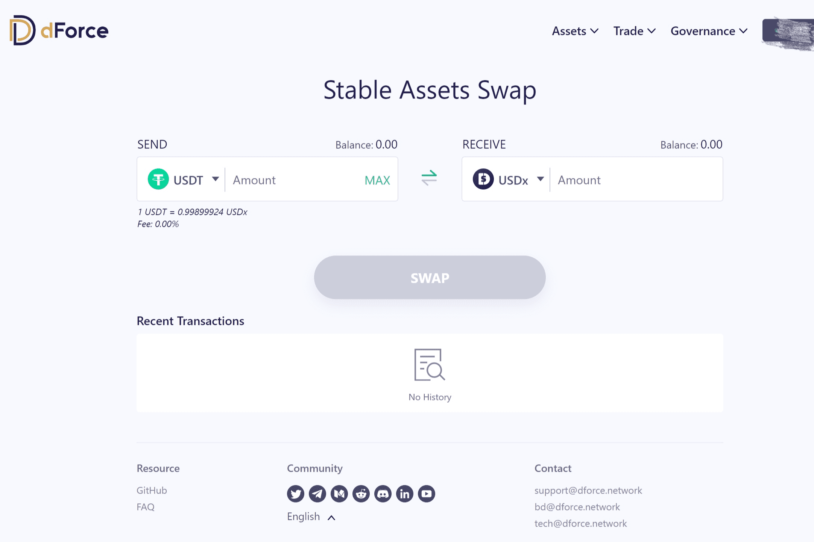

# dForce Trade

dForce Trade 是 dForce Network 推出的去中心化交易平台，用于促进大多数采用 ERC-20 标准的稳定币的即时交换，价格滑点为 0%，包括 USDx、HUSD、BUSD、USDT、USDC、PAX、TUSD，并具有更多资产集成进行。

dForce Trade 是一个 DEX 聚合器，利用算法搜索交易价格并跨多个平台聚合适当的流动性以提供优化的交易。

根据 CoinMarketCap 的数据，全球加密货币市值目前为 1.27 吨，比上一交易日上涨 0.04%。
过去 24 小时内，比特币 (BTC) 的交易价格在 28,582 美元至 30,299 美元之间。截至今天上午 09:00（UTC），BTC 交易价格为 29,557 美元，上涨 0.27%。
按市值计算的大多数主要加密货币交易情况好坏参半。市场表现突出的包括 DF、FIS 和 BICO，分别上涨 66%、45% 和 34%。

