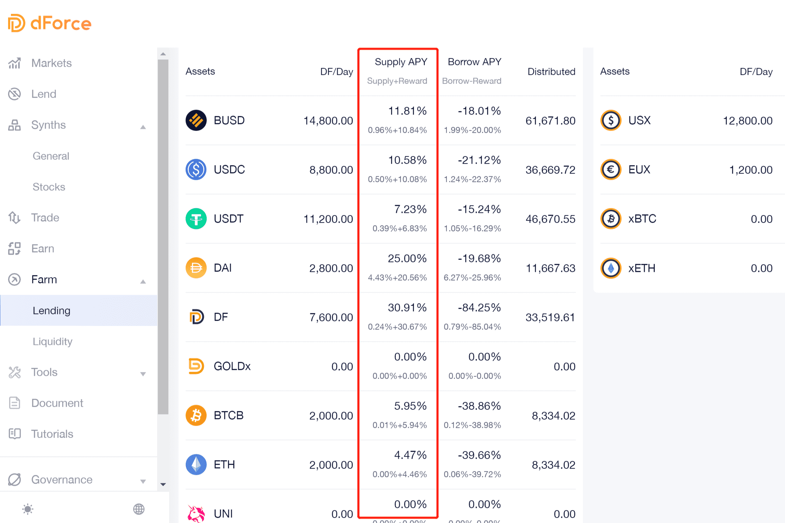

# dForce

dForce 倡导构建一个集成且可互操作的开放金融协议矩阵，涵盖资产（稳定币、合成资产、收益代币等）、借贷（全球流动性池）和交易（聚合器和 AMM）。我们的团队包括来自高盛、渣打银行、花旗银行、弘毅投资的加密货币资深人士和专业人士。 dForce 得到了包括 CMBI（招商银行国际）、Multicoin Capital 和火币资本（火币集团的投资部门）在内的投资者的支持。
我们与世界顶级安全公司（Trail of Bits、Consensys Diligence、Certik、Quantstamp、Certora、PeckShield、SlowMist、SECBIT）合作，对所有 dForce 原生协议进行智能合约审计。
dForce 代币 (DF) 是跨 dForce 网络的治理代币，赋予持有人影响有关 dForce 协议的决策的权力，包括新资产和抵押品的加入、风险参数的更改、费用应计、通过投票过程调整利益。
dForce 目前部署在以太坊和币安智能链 (BSC) 上。

