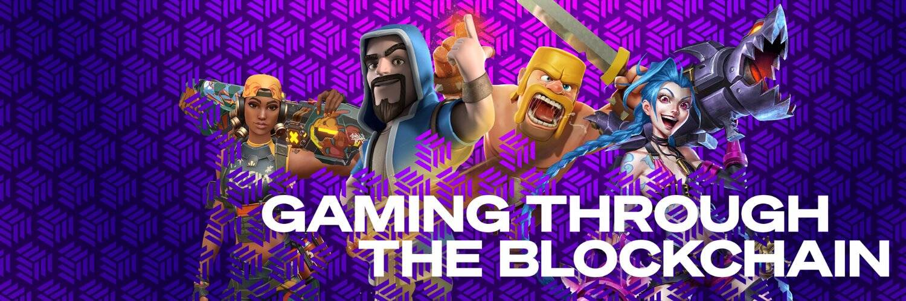

# DFSocial Gaming

DFSG 是一个 De-Fi 游戏平台。 Game-Fi 是区块链的最新趋势，除了资产的价格升值，游戏还被用来创造额外的利润流。将加密货币和视频游戏结合起来，让游戏玩家有机会通过参加锦标赛来赢得他们在加密奖池中的份额。由特殊和独特的 NFT（非同质代币）提供支持，智能合约会自动结算和管理币安智能链（BSC）上的所有奖励，以确保所有交易都是安全且轻松的。
是什么让 DFSocial 与众不同？

  游戏玩家和赞助商 - 游戏玩家可以在 DFSocial 上参与最流行的视频游戏，从而获得游戏奖励。 “赞助商”可以招募玩家平分游戏奖励。这种动态允许任何人参与并争夺奖池的份额。
  多样性 - DFSocial 提供从最现代的视频游戏到经典的棋牌游戏的所有内容。
  社区投票 - 团队不会选择接下来列出的游戏 - 社区会选择。
  工作产品 - DFSG 平台功能齐全，自 2020 年第四季度以来不断更新和整合并考虑想法。
  币安智能链上的 Staking 和 Farming 允许用户通过锁定 DFSG 代币来换取收益来获利。
  预测者 - 持有者可以通过预测我们任何活动的正确选项来锁定和赚钱，并获得他们的奖金份额。

提供的游戏：

  英雄联盟 (LoL)
  使命召唤 - 战区 (CoD)
  反恐精英：围棋 (CS: GO)
  斗殴之星（BS）
  扑克
  棋
  火箭联盟 (RL)
  我的世界 (MC)
  勇敢(VAL)
  国际足联
  皇室战争 (CR)。

