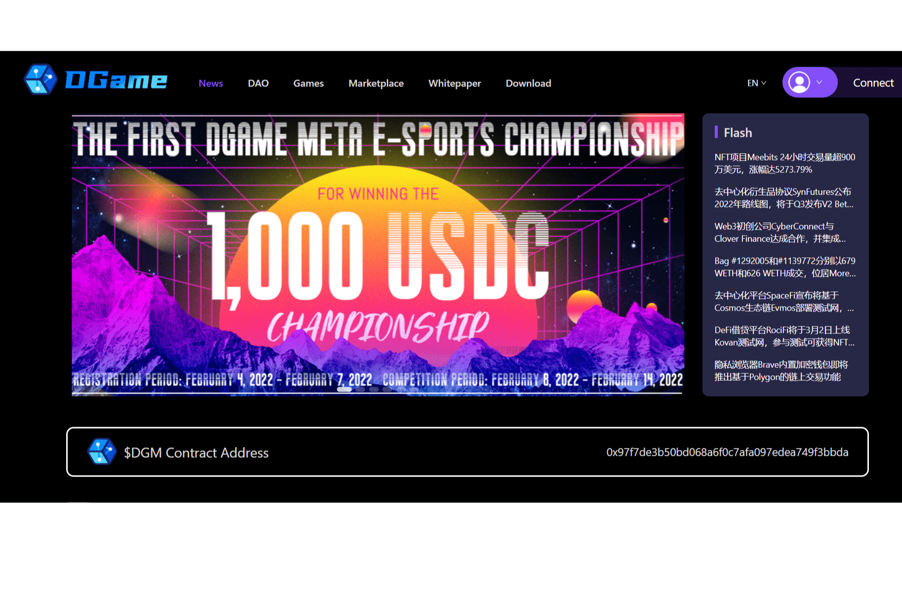

# DGame Meta

当用户通过围绕区块链游戏创建内容、搜索信息、参与社交网络和游戏竞赛或交易资产为 DGame Meta 生态系统增加价值时，我们将奖励用户 DGM、DGame Meta 原生代币。这反过来将有助于扩大游戏以社交赚钱和商店赚钱的模式。
DGame Meta 的用户包括游戏开发商、玩家、公会和投资者。与 Play-To-Earn 模式的单向消费不同，DGame Meta 依托媒体、社交和 NFT 市场功能，从广告费、分发、数据分析、共享客户服务、服务费、投资收益、直播流媒体、培训、赞助和提示、软件服务等，从而形成一个积极的经济循环，并为 DAO 和 DGM 持有者不断创造价值。
DGame Meta定位为Bloomberg+Reddit+Robinhood的元宇宙版，为游戏、玩家、公会和投资者提供一站式服务。我们的团队在全球最大的游戏市场从事web 2.0游戏开发和发行近十年，与数以万计的公会一起创造了无数奇迹，这让我们深刻理解了虚拟世界的力量和公会的需求。随着Web3.0浪潮的到来，我们希望通过DGame Meta的一站式服务，帮助更多的新玩家进入元界，让更多的公会进化为DAO，让更多优质的区块链游戏可持续运营，让投资者更好地发现机会.
DGame Meta 是游戏的狂热爱好者。我们欢迎有深度的玩家和真正在游戏中工作的人。我们的社区和组织将以人为本，以游戏为中心。

