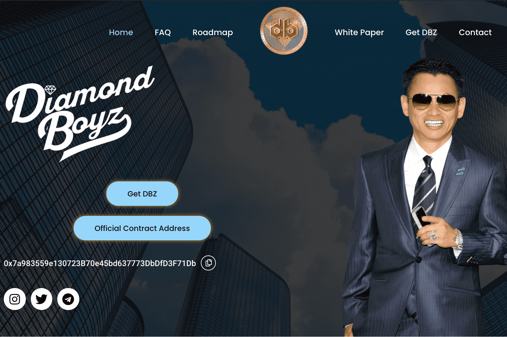

# Diamond Boyz Coin

DBZ Coin 旨在成为真品珠宝购买支付和验证的领导者，并为全球更快的汇款系统设定标准。通过引导用户了解如何获得 Diamond Boyz Coin，也向他们介绍了一种以有趣且有价值的方式与互联网互动的新方式。

Diamond Boyz Coin 今天的实时价格为 0.002276 美元，24 小时交易量为 49.81 美元。我们将 DBZ 实时更新为美元价格。 Diamond Boyz Coin 在过去 24 小时内上涨 0.13%。当前 CoinMarketCap 排名为 #7366，实时市值不可用。循环供应不可用，最大。供应 1,000,000,000 DBZ 硬币。

如果您想知道以当前价格在哪里购买 Diamond Boyz Coin，交易 Diamond Boyz Coin 股票的顶级加密货币交易所目前是 PancakeSwap (V2)。您可以在我们的加密交换页面上找到其他列表。

The Diamond Boyz Coin 成立于 2021 年 6 月，是一种基于 BEP20 的代币，使用 BNB 智能链弥合现实世界与区块链技术之间的差距。 $DBZ 与众不同，因为我们使用创始人 Johnny Dang 的名人网络与全球影响者建立了 20 年的长期合作关系。

Johnny Dang 是珠宝行业的主要人物，他的名人品牌在潜入加密货币行业时给了我们很大的回旋余地。 Diamond Boyz Coin 愿景是一个多方面的焦点，使用我们成熟的前锋 (Johnny Dang) 将加密领域的许多观点汇集在一起。

Diamond Boyz Coin 正在进行的开发计划是在交换 NFT 时使用 $DBZ 代币作为原生代币。 NFT 的最初用途是创建“Diamond Swap”，这是一个自定义编码票务市场，其中包含一系列音乐会（又名 NFT 收藏），其中的表演者也是当前客户。

随着硬币和技术的发展，它还将被用来完全构建“钻石交换”，以促进涉及娱乐和珠宝的更高级功能。 Diamond Boyz Coin 是 Johnny Dang 和 The Diamond Boyz 已经征服的行业的“包罗万象”。从 NFT 音乐会收藏到验证珠宝交易，$DBZ 将使用先前建立的行业引领加密货币技术。

