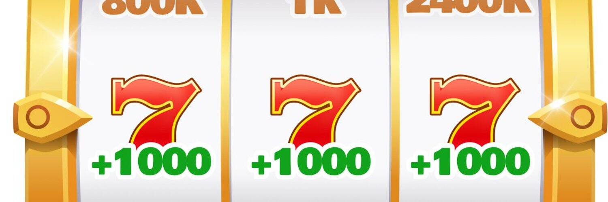

# DICE 3D

凭借 100% 的 TRX 分红和加密货币增长机制，Dice 3D 旨在为游戏中的玩家提供最佳的投资回报率。

骰子（单数骰子或骰子；来自古法语 dé；来自拉丁语 datum “给定或播放的东西”）是具有多个静止位置的小型可投掷物体，用于生成随机数。骰子适用于掷骰子等游戏的赌博设备，也可用于非赌博桌面游戏。传统骰子是一个立方体，它的六个面中的每一个都显示从 1 到 6 的不同数量的点（点）。当投掷或滚动时，骰子停止在其上表面显示从 1 到 6 的随机整数，每个值的可能性相同。各种类似的装置也被描述为骰子；这种特殊的骰子可能具有多面体或不规则形状，并且可能具有标有符号而不是数字的面。它们可用于产生除 1 到 6 以外的结果。加载和弯曲的骰子旨在使某些结果优于其他结果，以达到作弊或娱乐的目的。骰子盘，一种用来装掷骰子的盘子，有时用于赌博或棋盘游戏，特别是允许掷骰子不会干扰其他游戏棋子。

