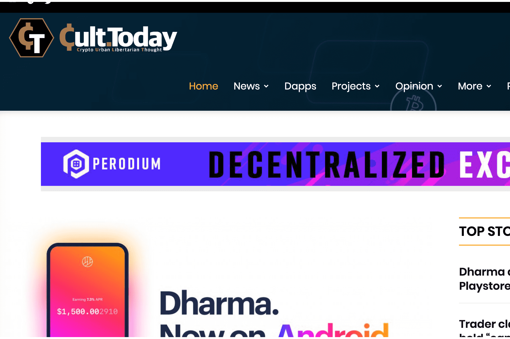

# Digital Media Tokens

数字媒体代币或 DMT 是奖励给 CULT.Today 读者的注意力代币。 CULT 是加密城市自由主义思想。我们涵盖每日加密新闻和分析。 CULT 获得的广告收入将作为 div 与具有 TronLink 扩展的读者共享。 DMT 将与更多的出版商合作，分发和奖励读者。
社交代币是一种加密货币，品牌、社区或有影响力的人可以使用它来超越典型的方式将自己货币化。如今，许多影响者、名人和企业都使用社交媒体或其他媒体流来通过他们的技能或服务获利。

