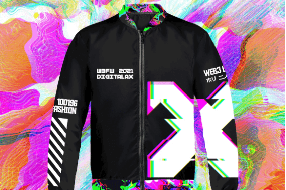

# DIGITALAX

DIGITALAX 是用于 Web3 时尚和开放元界的去中心化和可分叉协议栈。
DIGITALAX 在这里证明了 web3 时尚是将数百万新用户带入 web3 的缺失桥梁。我们已经建立了一个涵盖数字和实体时尚、NFT、游戏、电子竞技和虚拟世界的完整生态系统。
我们的社区由设计师、开发人员、模组制作者、游戏玩家、创作者和加密/DeFi 爱好者组成。我们通过我们的 Medium、Discord、Instagram、Twitter、Telegram、Linkedin 和 Youtube 帐户与我们的社区成员保持每日定期的积极沟通，并促进他们之间的持续增长和联系。
权力下放是我们的动画原则，它交织在我们所做的一切的结构中——通过技术基础设施、权力分配和价值交换的每一层的快速、渐进的发展。
该团队已将通过生态系统发布的所有代币分配为 0%，以实现最高的完整性发布。
我们正在为 web3 时尚供应链的民主化开发新工具，将全球开源精神与时尚创新联系起来。正是这种管道和连接构建了设计师和开发人员的交叉协作，以玩家为中心的奉献精神，将推动开放的元宇宙向前发展。
