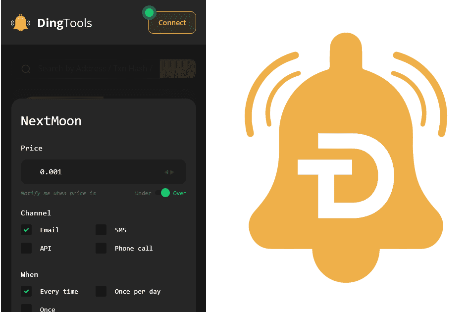

# DINGtools

DingTools 正在构建一个平台，使交易小盘代币更容易。它将交换工具带到了交易所之外。
不再经常检查图表。用户只需连接他们的钱包并为币安智能链或以太坊上的任何代币创建即时价格警报。
价格警报可以根据价格、交易量和图表指标创建，并且可以设置为通过电子邮件、短信、电话、浏览器通知或 WebHooks 接收。
您持有的 $DING 越多，您可以创建的警报就越多。 $DING 还将提供交易历史和损益统计数据，这些统计数据将 PankcakeSwap 和 Uniswap 上的每笔交易的交易费用和税收都考虑在内。

