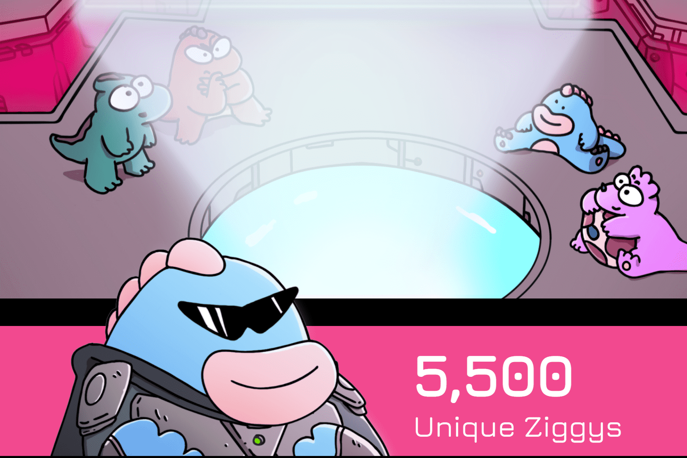

# DinoBabies

Dino Babies in Space 不仅仅是一个 NFT 项目，它是由 Matt Bolinger 创作的社区首部动画系列。 5,500 个 Genesis Dino Babies 中的每一个都允许其持有者参与 Dino Babies in Space 社区金库，并对节目制作的各个方面进行投票。通过拥有 Ziggy，您将参与下一部动画动作喜剧的完整创作过程。在恐龙宝宝 NFT 计划第 2 季中，太空海盗在创建链上闲置游戏方面提供了帮助。这款靠游戏赚钱的游戏是赚取 Dino Eggs 的唯一方式，让粉丝们可以与节目建立联系并帮助决定制作过程。

