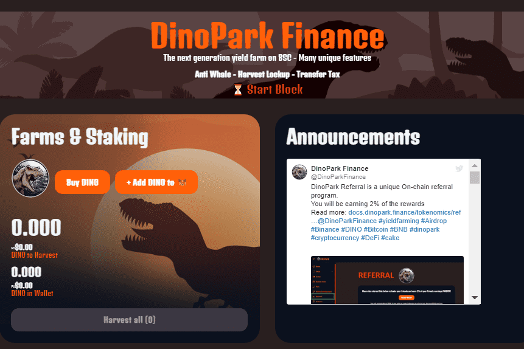

# DinoPark Finance

- 收获锁定：我们使用基于数量的收获锁定。收获锁定是一种独特的奖励锁定机制，用于限制收获的频率。
  DinoPark 是一个运行在币安智能链上的自动流动性获取收益农场和 AMM 去中心化交易所，具有许多独特和创造性的功能。
  核心特点：

- 转让税：DINO 的每笔交易（发送、交换、耕种等）都将被征收 4.5% 的转让税。

- 自动销毁机制：每笔交易将销毁 4.5% 转让税的 0%（交易金额的 0.9%）。

- 自动流动性：每笔 DINO 交易将被征收 4.5% 的转让税。 3.6% 的转让税通过合约自动添加到流动资金池中。

- 反鲸鱼：超过总供应量 0.5% 的交易将被拒绝。随着总供应量的增加，这个比例会降低。

  
