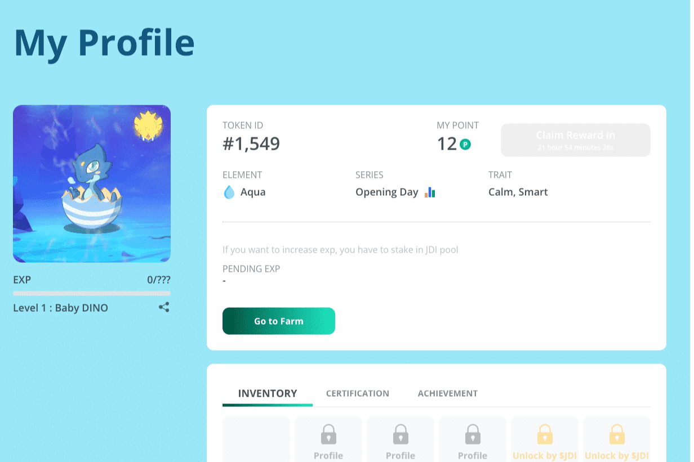

# DINOPARK TOKEN

来自 JDI Yield 的创建者 (https://jdiyield.com)
恐龙公园是一种通货紧缩的被动回报代币。只需将 $DINOP 放在您的钱包中，您就会看到您的硬币数量增加。每笔交易都会自动将代币分发给所有持有者。
DINOP 是 DINOPARK 中的货币，这是一个基于 NFT 的游戏，使用 BSC。用户可以在平台上创建、玩或交易他们的 NFT 东西。
每笔交易

  向恐龙公园持有者支付 3% 的税
  用于创建 DINOP-BNB LP 的 2% 税
  开发基金的 2% 税
  其中 1% 用于购买 JDI 并每周销毁 0.5% 用于营销 0.5% 用于开发活动

NFT 配置文件
个人资料是您在公园内的身份

  个人资料可以升级。从鸡蛋到成年恐龙
  有库存可以在平台上使用物品
  收集基于 NFT 的物品、零件、艺术品等
  每个配置文件可以有 5 个恐龙机器人部分，其中有不同的统计数据
  个人资料和物品是可交易的。每个都有一个唯一的编号，并在有限的时间内发布
  升级可以通过恐龙公园完成

恐龙公园
拥有 DINOPARK 档案的用户可以在 DINOPARK 平台上进行如下活动

  使用来自 DINOBOT 零件的统计数据进行战斗以赚取 DINOP
  质押合作伙伴代币以获得 NFT 个人资料等级
  每个公园都需要不同级别的恐龙档案
  质押合作伙伴代币以赚取有限的 NFT
  特定的 NFT 项目可用于

市场

  每个 NFT 项目都可以通过市场进行交易
  部分物品可以通过竞价系统进行交易

