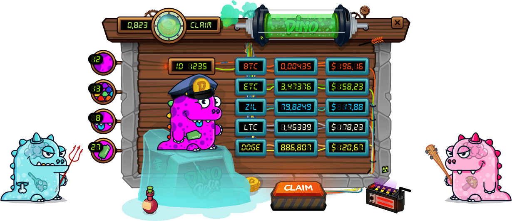

# DinoPolis

DinoPolis 是一个 Mining NFT 项目，也表示为 Play-To-Earn 游戏。
项目让任何人都有机会成为加密行业的一部分，并在全球加密货币 HashRate 中拥有自己的份额。它由许多基础设施元素组成，其中 10.000 个 GenesisDino NFT 是主要元素。
这些 NFT 中的每一个都有一组具有不同特征的独特属性，这些属性以单个 HashPower 表示，并以此为基础计算总池的份额。
GenesisDino NFT 的销售收益用于购买用于挖掘去中心化加密货币的设备：BTC、ETH/ETC、ZIL、LTC、DOGE 和全面运营所需的基础设施。
Dinopolis 项目有什么用？
它解决了可访问性和拥有自己的加密货币哈希率容量的问题。任何人都可以在没有大量投资的情况下成为加密行业的一部分。
它解决了购买昂贵的采矿设备的问题。批发采购更便宜，供应商经过验证。它解决了将购买的设备连接到电力的问题。西伯利亚地区电力过剩。电费为 0.05 美元千瓦时。
解决了采矿时控制设备不间断运行的问题。只有专业人员组装、设置和维护设备。
它解决了采矿设备的冷却问题。安装设备的西伯利亚地区的年平均气温为 -1 °C / 30 °F。
它解决了碳足迹问题：运行设备的电力来自水力发电厂。

