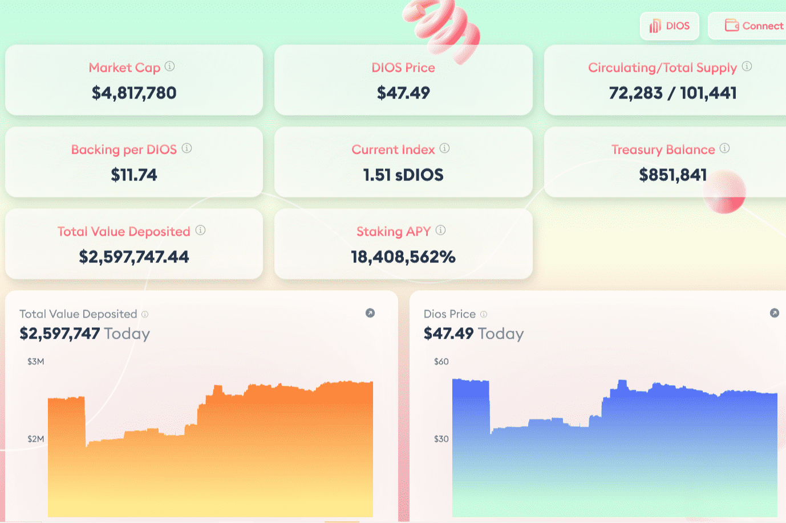

# Dios Finance

问题
与美元挂钩的稳定币是加密世界的重要组成部分。交易者可以使用它们进行各种交易，知道相同数量的稳定币无论在哪一天都有相同的购买力。然而，这是一种误解。随着美国政府和美联储对美元的控制，这几年不断的印钞，肯定会让美元贬值，导致稳定币明显贬值。
我们的解决方案
Dios Finance 旨在通过建立一个由多种资产支持并专注于供应扩张和控制的代币来解决这个问题。我们相信 DIOS 代币可以在市场波动的情况下保持其购买力。
我们的目标
我们最初的目标不是找到一个稳定的价格。这似乎与我们的货币愿望背道而驰，但我们向您保证并非如此。可以调整 Dios Finance 以针对不同的事物进行优化。主要的权衡是波动性和盈利能力与稳定性和一致性。波动性和利润伴随着增长；这就是我们早期想要的。由于政策和规模的紧缩，Dios Finance 应该作为一种稳定的资产运作良好。上行和下行压力应稳定在某个非内在值。政策宽松，无论规模大小，Dios Finance都有潜力充当财富创造机器。代币的市场溢价衡量游戏的正和；所有外在价值都是创造的新财富。

