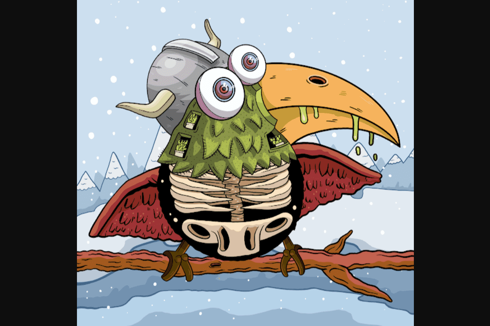

# Dirtybird Flight Club

Dirtybird 于 2005 年开始作为地下唱片公司，但标志的历史始于中学时的 Claude VonStroke，当时他正在画愚蠢的小鸟，希望能让他的兄弟姐妹发笑。你在这里看到的第一个 Dirtybird 标志是由 Claude 在餐巾纸上勾勒出来的，从那以后他一直在倡导和收集低俗的超现实主义艺术品。自 2012 年以来，唱片公司与杰里米·菲什、杜尔克、拉乌尔·德勒奥、丹·梅、查理·伊默、格雷厄姆·卡特、费利西亚·乔、切玛·门德斯和伯德卡普等世界著名艺术家合作。
由于对 NFT 的热爱，Dirtybird Flight Club 在这个领域具有独特的定位。与其他项目不同，Dirtybird 有能力利用其 16 年历史的 IRL 服装、活动和音乐公司为其代币持有者提供难以置信的价值。例如，代币持有者将能够赢得 Dirtybird Campout、Dirtybird CampINN 和 Dirtybird BBQs 的真正节日门票；包括新的原创活动和仅限会员的聚会。独家音乐和其他令人难以置信的福利将在未来几个月内公布。

