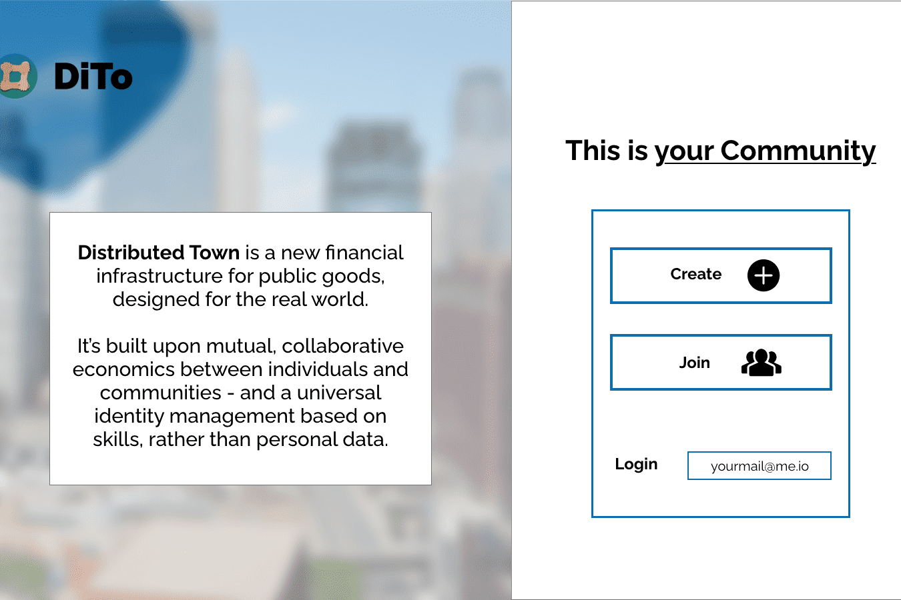

# DistributedTown (DiTo)

DistributedTown 是协作经济学的新标准。我们正在建立一个相互关联的、自主的社区网络。
它允许任何人加入或创建自己的 - 它基于 DiTo 相互信用和称为 SkillWallet ID 的通用登录。
在我们的 beta 版本（11 月 12 日）中，我们已经准备好加入任何类型的社区 - 从需要优化任务的 3 人 Web3 团队到需要实现自我可持续性和相互支持。
我们的协议还建立在 Quadratic Funding 的开创性模型之上，使用我们的 Proof-of-Contribution 和 DiTo 持续资金模型来解决严重的问题，例如 Pool Manipulation 和 Sybil Attacks。
这三个方面的结合为现实世界的非投机、100% 匿名网络奠定了坚实的基础。根据他们的实际技能、优点和对社区和整个网络的贡献，代表真实的人（并以 UBI 方式获得奖励）。
允许一个更加独立、自由的社会，银行账户、护照、简历和官僚机构在设计上是无用的。

