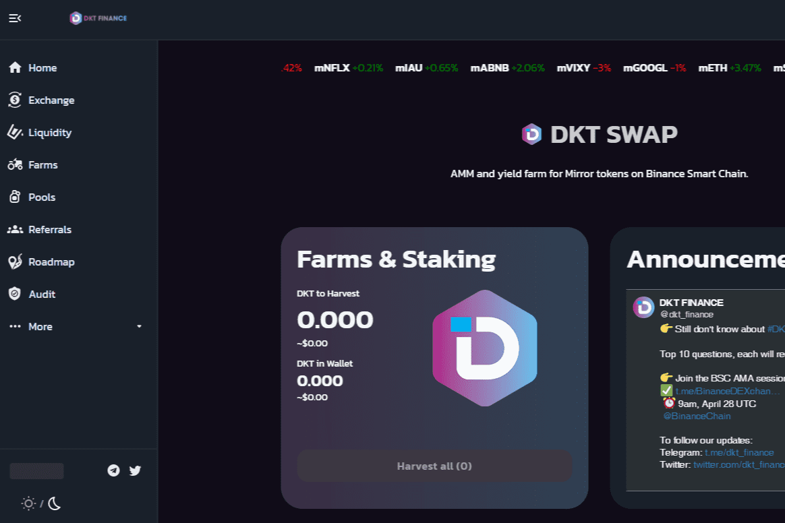

# DKT DAPP

DKT SWAP 允许任何人在币安智能链上交换资产支持代币和合成代币。 BEP20 代币可以通过与流动性池交互以去中心化的方式进行交换。用户可以将任意一对 BEP20 代币放入相应的池中，平台将生成一个 LP 代币作为交换。 LP 代币持有者将在交易对之间的每次交换中获得奖励。在本节中，我们将详细介绍 DKT FINANCE 的不同特征。
DKT DAPP 可以使用其治理协议进行升级。任何迁移都必须得到 DKT 代币持有者的批准，而不是单方面能够迁移流动资金池。该策略将允许 DKT DAPP 发展并保持增长，同时确保任何变化都对代币持有者有利。治理合约在 Timelock 合约之后，因此不同意投票结果的 DKT 持有者将有时间退出矿池。

