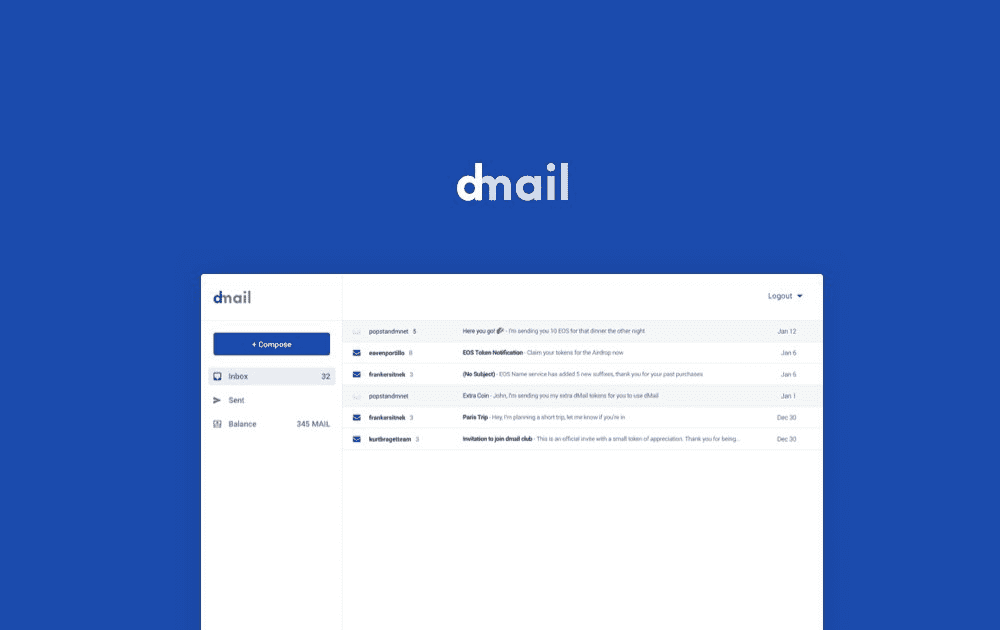

# dmail

新互联网上的电子邮件

[Dmail](https://mail.delicious.com/) 是一個類似於 Snapmail 的概念，這個想法是從 Delicious.com 內部人員自身的親身經歷而來，他們想**透過 Email 來發送敏感資訊，但又希望可以獲得更好的保護。**這項服務的核心理念是「寄件人應該擁有電子郵件的內容存取權力」，現在，你不僅可以控制內容何時失效，甚至能從遠端把郵件內容刪除。Dmail 並不是獨立存在的郵件服務，必須依附在 Gmail 使用，事實上它是一款 Google Chrome 擴充功能，寄件者在下載、安裝後，就能夠開啟一個新的 Dmail 按鈕，利用它來寄送需要高度隱私或敏感內容，就能設定郵件內容刪除時間，或從遠端將它移除。

除此之外，Dmail 會自動加密寄出的郵件內容，即使對方沒有安裝 Dmail 一樣可以開啟及閱讀。寄件者可以在任何時候移除內容的存取權限，收件者將無法繼續讀取內容，也包括其他人。

