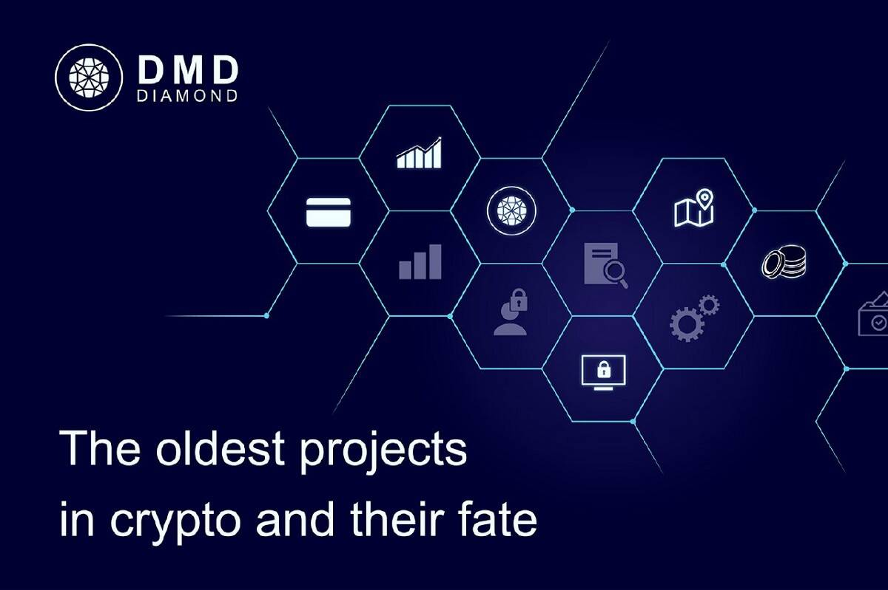

# DMDT

钻石币项目发行的数字资产为钻石币，符号为DMDT（Diamond Token），是基于TRON TRC20协议的数字资产，发行量30000枚，
5000 件用于预挖。
第一个有 DAPP 的项目就是挖矿，DAPP 平台的收益将用于代币回购，并配合代币销毁机制，形成强大的通货紧缩模型，不断增值。
DMDT 特性
1.交易销毁：当一个DMDT被转移时，一部分代币会被智能合约烧掉（永久销毁），代币通缩，价值飞上月球。
2、实时分红：DMDT-TRX LP质押分红，通过智能合约实现，去中心化挖矿，实时分红，实时提取，收益可观，安全可靠。
3.回购销毁：DAPP平台收益将用于代币回购，配合代币销毁机制，形成强通缩模型，持续增值。
4.手续费优惠：参与DICE游戏，TRX质押矿在提币时可享受高额佣金优惠。
5、邀请红利：DMDT平台多DAPP，受邀者越多，红利越多。
6、游戏平台：经典游戏再现，平台游戏与挖矿红利双重体验。更多DAPP游戏敬请期待。

