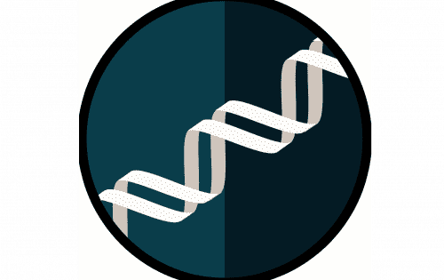

# Dna Cash

BNB 奖励池，每日 13% 的回报，15% 的推荐奖励和最低的开发费用。脱氧核糖核酸现金。 BNB 矿工，13% 每日奖励，15% 推荐，最低开发费。产量农业。STONY BROOK N.Y.，2018 年 11 月 26 日 – Applied DNA Sciences Inc.（纳斯达克股票代码：APDN，“Applied DNA”，“公司”），大规模基于 PCR 的 DNA 制造领域的领导者 #5322。一般来说。 #1154在高风险。 #1948 年。在 BNB 链中。

