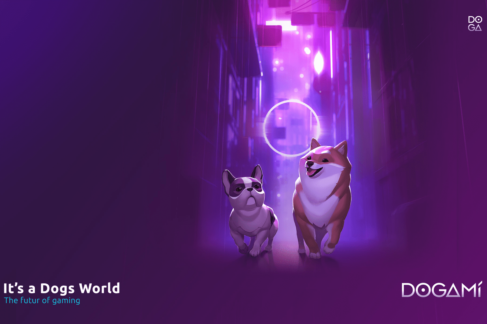

# DOGAMÍ

发现 DOGAMÍ！一款独特的靠游戏赚钱的 AR 手机游戏，玩家可以在其中收养和饲养制作精美的虚拟 NFT 狗。
DOGAMÍ 开创性的生态系统使用户能够获得专有的实用代币 $DOGA，这是 DOGAMÍ 元宇宙的内部货币！ $DOGA 用于购买附加组件、升级和定制 DOGAMÍ、在游戏内交易物品、购买新狗以及与其他玩家互动。它还作为一种治理和质押代币，为其持有者提供决定游戏未来的能力，同时通过 DeFi 赋予他们权力。
每只狗都有自己的特定属性，在不同的阶段进化，玩家可以参加实时比赛和赛事。你养的狗越好，你赚的越多！当您将您的狗从小狗训练成您最好的朋友时，您选择的每个动作都会为您赢得 $DOGA。此外，$DOGA 需要培育新的 DOGAMÍ，可以在二级市场上保留或出售给新的所有者。
DOGAMÍ 由 4 位联合创始人于 2021 年年中创建，拥有一支由 20 名全职员工组成的团队，其中许多人在游戏开发方面拥有丰富的经验。它被 Sifted 列为欧洲值得关注的 15 家游戏初创公司之一。 DOGAMÍ 早期由 The Sandbox 联合创始人 Sebastien Borget 提供建议。公司通过育碧、Animoca Brands、XAnge Ventures等世界知名投资方成功融资600万美元。

