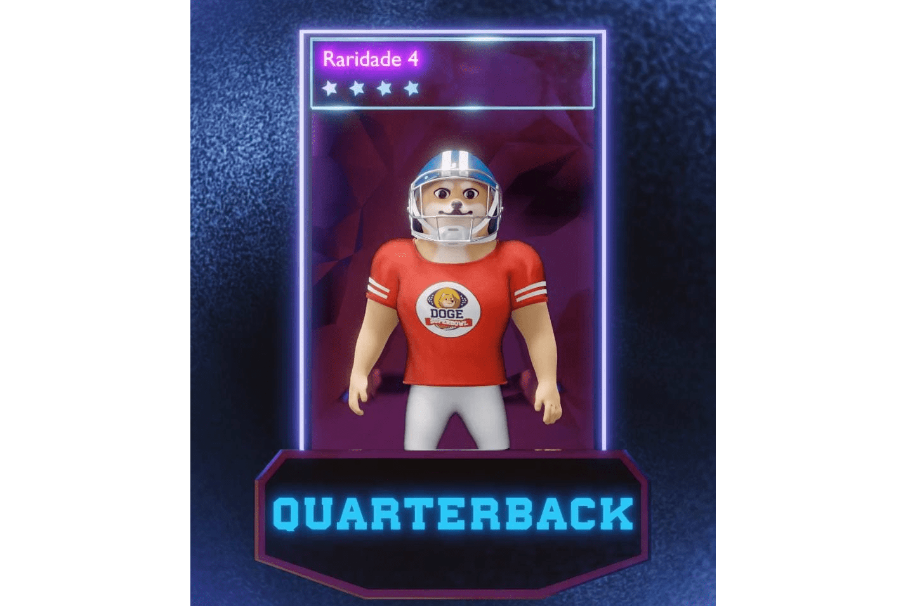

# Doge SuperBowl

xxxxxxxxxx 总督超级碗作为游戏的本地货币。玩家使用 Doge Superbowl (DSBOWL) 封装角色，在游戏市场（未来）进行买卖。 DogeSuperbowl 是一款基于 NFT 的在线视频游戏，它使用基于 Binance 的加密货币 (DSBOWL)。它是目前唯一的美式足球系列。最大供应量为 100,000,000 个代币。流动性将被锁定，开发资金将用于游戏更新我们的使命是为我们的投资者提供有趣和有利可图的体验，围绕区块链游戏创建一个健康活跃的社区。Doge Superbowl 通过游戏发行 DSB 并为玩家 NFT 赋予价值，利用 Play-to-Earn 模型，通过未来的功能增加其使用。角色需要在 Doge Superbowl 的竞技场中战斗 任何用于翻转角色的 Doge superbowl 都会发送到处理战斗支出的合同。每个角色在转身时都会随机附上一颗星星（瑞瑞）。目前没有办法改变角色的稀有度。

