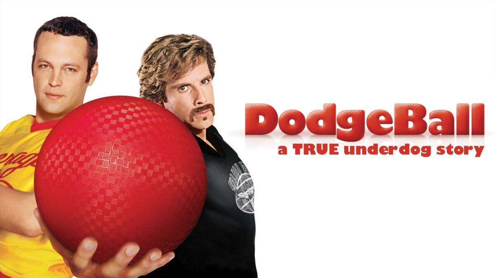

# Dogeball

狗狗球以世界杯为主题。基于狗 NFT 和问答平台的创新区块链生态，我们知道全球有 5 亿爱狗人士，而足球是世界上最受欢迎的运动，拥有数十亿的粉丝。顺便说一句，世界杯是足球界的顶级比赛。每次世界杯开赛，都会有数亿人参与竞猜，竞猜金额将超过1000亿美元。这将是一个巨大的市场，狗是加密社区中最受欢迎的动物。 ，我们将在币安NFT交易市场OPENSEA上架这些萌犬NFT，销售额将全额回购并销毁，获得这些萌犬NFT的用户将不定期空投至Doge Ball交易手续费股息，另一个使我们与众不同并赋予特殊价值的特征是税收机制。用户每次交易，会有6%的税，1%给狗狗球NFT持有者，2%销毁，3%用于发展，这会给我们更大的动力和力量持续研发优质产品，足球竞猜2%费用销毁机制，让Doge球更加稀有。

