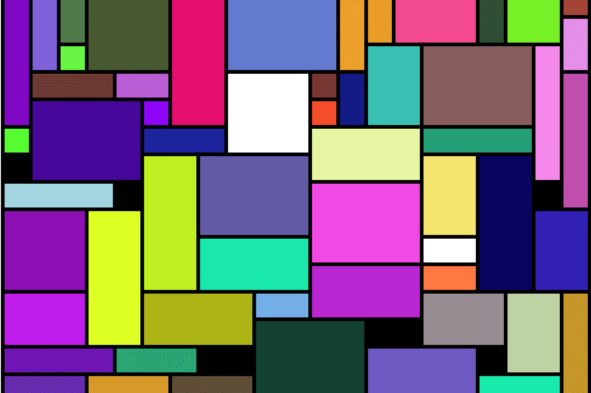

# Dogecolors

doge colors 是多边形网络上的 NFT dapp。如果没有人认领，您可以免费铸造任何颜色。有超过 24,000 种命名颜色可供选择。每种颜色都有与之相关的稀有性。Dogecolors 是一个 NFT 平台。在它上面，你可以铸造彩色 NFT。换句话说，Dogecolors 允许您以不可替代令牌的形式在以太坊的 L2 协议上拥有颜色。您可以拥有超过 160 万种颜色。 Dogecolors 是一个去中心化的平台。

