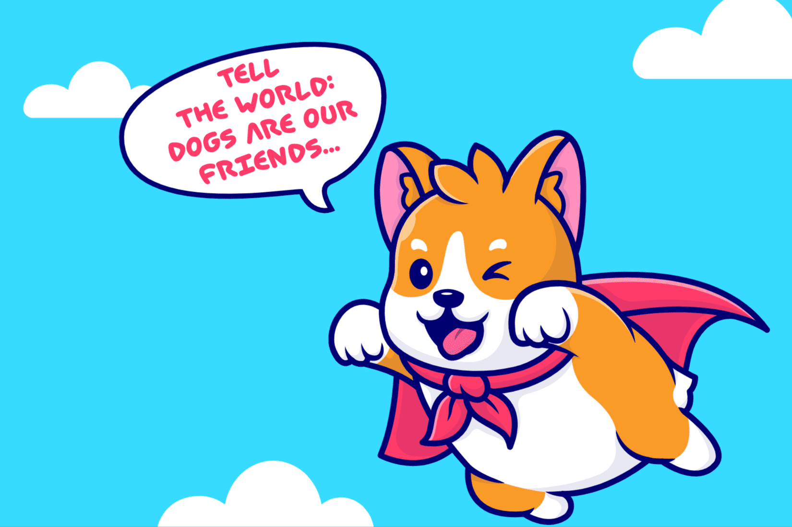

# DogEdu

Dogedu 是一个去中心化的社交协议，它促进了保护狗的方法、想法和活动，并向世界传达了狗是人类朋友的信息。
它不仅是爱狗人士的最佳社交网络，也是动物权利倡导者提高声音以被倾听的最佳社交网络。
用户只需要创建关于狗的有用内容，然后获得教育活动的代币奖励。
Dogedu 识别内容并根据与该内容相关的意见的价值分配奖励。我们将内容定义为用户认为值得判断的任何特定在线数据，包括但不限于文本、图像、视频、位置、帐户和链接。每个动作的价值取决于用户的影响力。影响力指标是参与度、长期持有量和声誉的函数。
代币奖励机制铸造新的 DOGU 代币并根据影响力进行分配。该协议激励用户赚取并持有 DOGU 以增加影响力，同时在网络上进行评分

